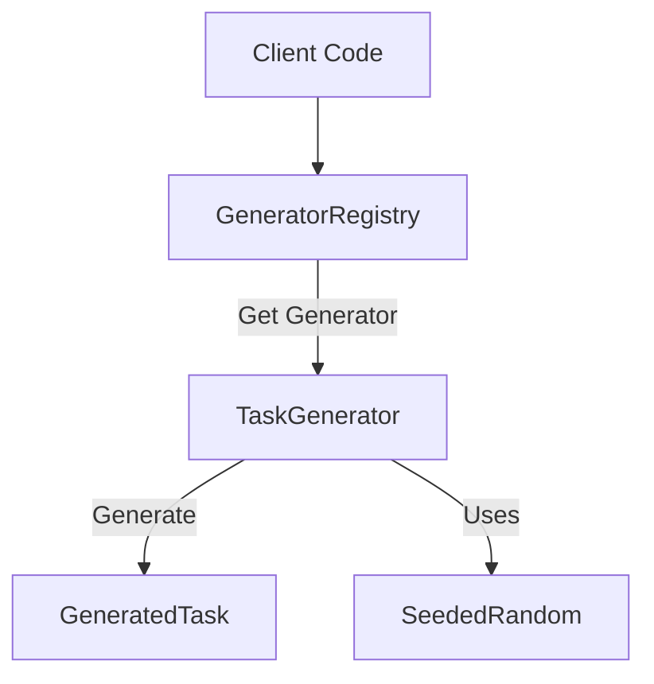

# Task Generation Engine

## Overview
The Task Generation Engine is the core system responsible for creating unique, randomized math problems on demand. Unlike static exercises, this engine generates content algorithmically, ensuring that students can practice the same concept multiple times with different numbers and contexts.

## Architecture
The system uses a **Registry Pattern** to manage different task generators.



### Key Components

- **`GeneratorRegistry`**: A singleton service that registers and retrieves task generators.
- **`TaskGenerator`**: The interface that all generators must implement.
- **`LogicBasedGenerator`**: Abstract base class for algorithmic generators (99% of current tasks).
- **`LLMGenerator`**: Abstract base class for AI-powered generators (via OpenAI).

## Usage

To generate a task, you typically use the convenience functions exported from `src/generators/index.ts`.

```typescript
import { generateTask } from 'src/generators'

// Generate a random task of a specific type
const task = await generateTask('tal_broeker_og_antal', {
  difficulty: 'middel',
  seed: 12345 // Optional: ensures reproducible results
})

console.log(task.questions[0].text)
```

## Supported Task Categories
The engine currently supports over 20 task types across three main mathematical domains:

1. **Tal og Algebra** (Numbers & Algebra)
   - Arithmetic, Equations, Fractions, Percentages, etc.
2. **Geometri** (Geometry)
   - Units, Angles, Area/Volume, Transformations.
3. **Statistik** (Statistics)
   - Charts, Probability, Statistical descriptors.

