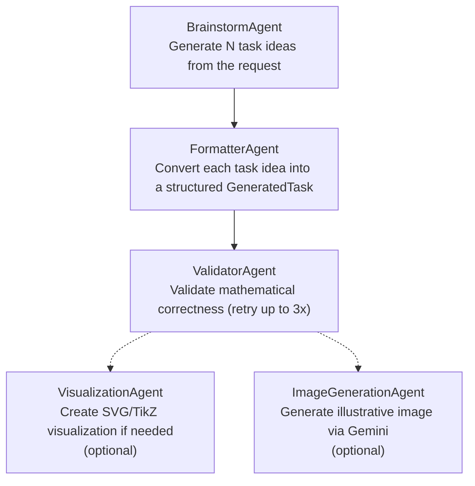
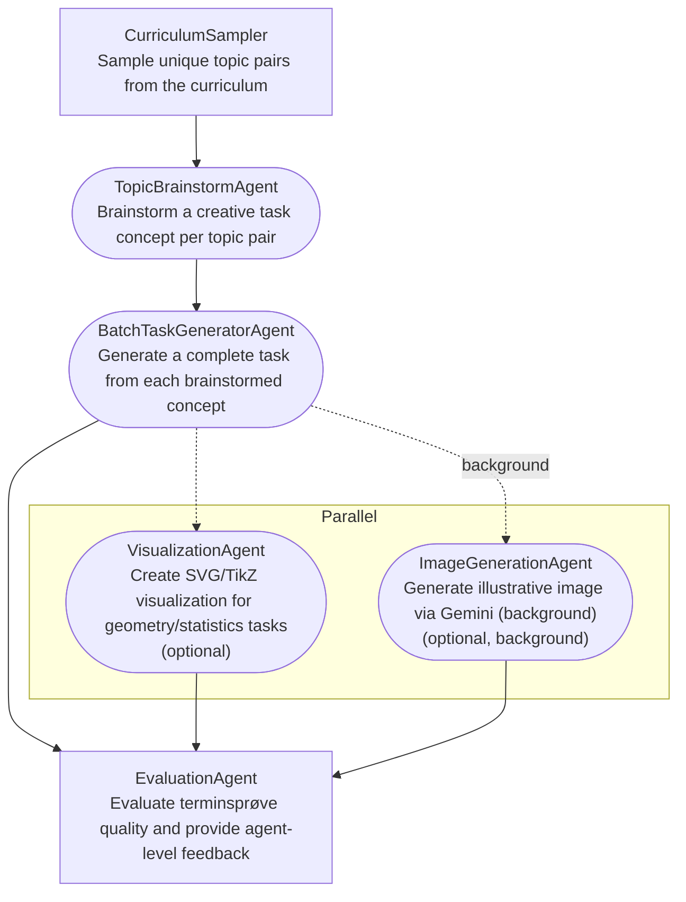
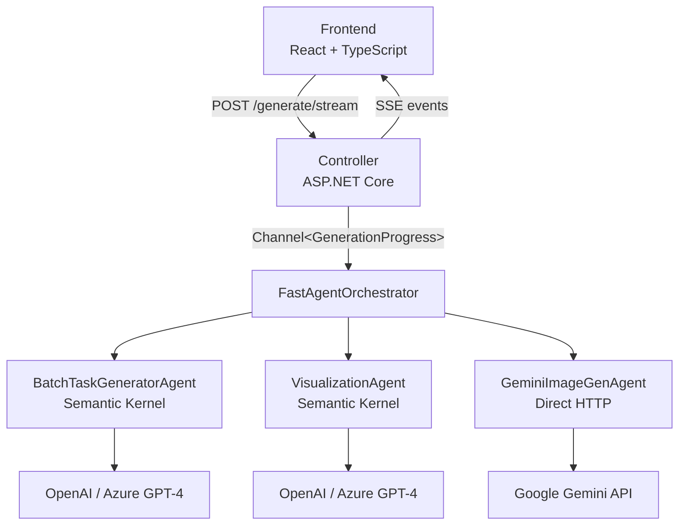

# Agent Orchestration Architecture

This document describes how the multi-agent system for generating Danish math exam tasks (terminsprøver) is designed, orchestrated, and executed.

---

## Table of Contents

1. [Overview](#overview)
2. [Technology Stack](#technology-stack)
3. [Agents](#agents)
4. [Orchestration Layer](#orchestration-layer)
5. [Communication & Streaming](#communication--streaming)
6. [Frontend Integration](#frontend-integration)
7. [Configuration](#configuration)
8. [Data Flow Diagrams](#data-flow-diagrams)

---

## Overview

The system uses a multi-agent pipeline to generate complete math exam papers. A user request flows through specialized AI agents — each responsible for a distinct phase of task creation — coordinated by an orchestrator that manages sequencing, parallelism, progress reporting, and error handling.

There are **6 agents** and **2 orchestrator strategies** (Standard and Fast). The default is Fast mode, which batches LLM calls for ~70% token reduction and ~3-5x speed improvement.

All agents run **in-process** within a single .NET 9 backend. There are no external message queues, service buses, or inter-process communication — agents are coordinated via direct async method calls and dependency injection.

---

## Technology Stack

| Layer | Technology |
|-------|-----------|
| Backend framework | .NET 9.0 / ASP.NET Core Web API |
| AI framework | Microsoft Semantic Kernel 1.32.0 |
| LLM provider | OpenAI GPT-4 (or Azure OpenAI via Azure AI Foundry) |
| Image generation | Google Gemini API (direct HTTP) |
| Frontend | React 19 + TypeScript + MobX + Framer Motion |
| Build tooling | Vite 7.2 (frontend), .NET CLI (backend) |
| Streaming protocol | Server-Sent Events (SSE) over HTTP |
| Data storage | File-based (YAML tasks, JSON terminsprøver) |

---

## Agents

### Base Class: `BaseSemanticKernelAgent`

All Semantic Kernel agents inherit from `BaseSemanticKernelAgent`, which provides:

- A shared `Kernel` instance and `IChatCompletionService`
- `ExecuteChatAsync(userMessage)` — sends a system prompt + user message to the LLM
- `ExecuteChatWithHistoryAsync(chatHistory)` — sends a full conversation history
- Configurable `MaxTokens` and `Temperature` via `AgentConfiguration`

**Location:** `backend/MatBackend.Infrastructure/Agents/BaseSemanticKernelAgent.cs`

---

### 1. BrainstormAgent

| Property | Value |
|----------|-------|
| Interface | `IBrainstormAgent` |
| Purpose | Generates initial task ideas based on the request parameters and available task types |
| Input | `TerminsproveRequest` + list of available task type IDs |
| Output | `List<TaskIdea>` |
| Used in | Standard orchestrator only |

**Location:** `backend/MatBackend.Infrastructure/Agents/BrainstormAgent.cs`

---

### 2. FormatterAgent

| Property | Value |
|----------|-------|
| Interface | `IFormatterAgent` |
| Purpose | Converts a rough task idea into a fully structured `GeneratedTask` with question text, answer options, solution steps, and metadata |
| Input | `TaskIdea` |
| Output | `GeneratedTask` |
| Used in | Standard orchestrator only |

**Location:** `backend/MatBackend.Infrastructure/Agents/FormatterAgent.cs`

---

### 3. ValidatorAgent

| Property | Value |
|----------|-------|
| Interface | `IValidatorAgent` |
| Purpose | Validates a generated task for mathematical correctness, solvability, and appropriate difficulty |
| Input | `GeneratedTask` |
| Output | `ValidationResult` (IsValid, IsSolvable, HasCorrectAnswer, Issues) |
| Used in | Standard orchestrator only (Fast mode self-validates during batch generation) |

**Location:** `backend/MatBackend.Infrastructure/Agents/ValidatorAgent.cs`

---

### 4. VisualizationAgent

| Property | Value |
|----------|-------|
| Interface | `IVisualizationAgent` |
| Purpose | Creates SVG/TikZ/chart visualizations for tasks that need them (geometry, statistics) |
| Input | `GeneratedTask` |
| Output | `TaskVisualization?` |
| Used in | Both orchestrators |

**Location:** `backend/MatBackend.Infrastructure/Agents/VisualizationAgent.cs`

---

### 5. BatchTaskGeneratorAgent

| Property | Value |
|----------|-------|
| Interface | `IBatchTaskGeneratorAgent` |
| Purpose | Generates multiple complete tasks in a single LLM call, combining brainstorming + formatting + validation into one step |
| Input | `BatchGenerationRequest` (count, level, exam part, categories, difficulty) |
| Output | `List<GeneratedTask>` |
| Used in | Fast orchestrator only |

This agent is the key optimization — it replaces the Brainstorm → Format → Validate pipeline with a single prompt that produces 5 ready-to-use tasks per call.

**Location:** `backend/MatBackend.Infrastructure/Agents/BatchTaskGeneratorAgent.cs`

---

### 6. GeminiImageGenerationAgent

| Property | Value |
|----------|-------|
| Interface | `IImageGenerationAgent` |
| Purpose | Generates illustrative images for tasks using Google Gemini's multimodal API |
| Input | `GeneratedTask` |
| Output | Image URL string (served as static file) |
| Used in | Both orchestrators (when enabled) |

This is the only agent that does **not** use Semantic Kernel. It makes direct HTTP calls to the Gemini API using `HttpClient`, requesting `responseModalities: ["TEXT", "IMAGE"]`. Generated images are saved to disk and served via ASP.NET static file middleware at `/api/images/{filename}`.

**Location:** `backend/MatBackend.Infrastructure/Agents/GeminiImageGenerationAgent.cs`

---

## Orchestration Layer

The orchestrator interface `IAgentOrchestrator` defines two methods:

```csharp
Task<TerminsproveResult> GenerateTerminsproveAsync(
    TerminsproveRequest request,
    IProgress<GenerationProgress>? progress = null,
    CancellationToken cancellationToken = default);

Task<GeneratedTask> RegenerateTaskAsync(
    GeneratedTask failedTask,
    ValidationResult validationResult,
    CancellationToken cancellationToken = default);
```

Which orchestrator is used is determined at startup by the `Generation:FastMode` config flag (defaults to `true`).

---

<!-- BEGIN AUTO-GENERATED PIPELINE DIAGRAMS -->

### Standard Orchestrator

Sequential pipeline that processes tasks one at a time through all agents.



### Fast Orchestrator

Parallel pipeline with curriculum-based topic sampling and per-task LLM calls.



<!-- END AUTO-GENERATED PIPELINE DIAGRAMS -->

**Standard Orchestrator Characteristics:**
- 4 LLM calls per task (brainstorm is shared, then format + validate + visualize per task)
- Sequential processing — each task completes before the next begins
- Validation retry loop: up to 3 attempts per task, regenerating on failure
- Progress events emitted at each phase transition

**Location:** `backend/MatBackend.Infrastructure/Agents/AgentOrchestrator.cs`

---

**Fast Orchestrator Characteristics:**
- 1 LLM call per task with parallel execution (up to 5 concurrent)
- ~70% token reduction, ~3-5x faster
- Tasks are self-validated during generation (no separate validation step)
- Image generation runs in background `Task.Run` — fires immediately per task, doesn't block the next batch
- Visualizations run in parallel via `Task.WhenAll`
- Staggered progress events (60ms for TaskStarted, 120ms for TaskCompleted) for smooth frontend animation
- Only geometry and statistics tasks get visualizations (`geo_*`, `stat_*`, `geometri_og_maaling`, `statistik_og_sandsynlighed`)

**Location:** `backend/MatBackend.Infrastructure/Agents/FastAgentOrchestrator.cs`

---

## Communication & Streaming

### API Endpoints

The controller `TerminsproveController` exposes:

| Method | Endpoint | Purpose |
|--------|----------|---------|
| `POST` | `/api/terminsprove/generate` | Synchronous generation (returns full result) |
| `POST` | `/api/terminsprove/generate/stream` | Streaming generation via SSE |
| `GET` | `/api/terminsprove` | List all generated terminsprøver |
| `GET` | `/api/terminsprove/{id}` | Get a specific terminsprøve |
| `GET` | `/api/terminsprove/{id}/log` | Get the orchestration agent log |
| `GET` | `/api/terminsprove/task-types` | List available task types |
| `GET` | `/api/terminsprove/health` | Health check |

### Streaming Architecture

The streaming endpoint uses `IProgress<GenerationProgress>` combined with `Channel<T>` for thread-safe event queuing:

1. The controller creates a `Channel<GenerationProgress>` (unbounded)
2. It wraps the channel writer in a `Progress<GenerationProgress>` callback
3. The orchestrator is launched on a background task, reporting progress via `IProgress<T>`
4. The controller reads from the channel and writes SSE-formatted lines to the response stream

**SSE Event Format:**
```
data: {"type":"taskStarted","status":"formatting","message":"Genererer opgave 1...","tasksCompleted":0,"totalTasks":10,"taskIndex":1}\n\n
```

### Progress Event Types

```csharp
enum ProgressEventType
{
    Progress,              // General progress update
    PhaseStarted,          // New pipeline phase started
    TaskStarted,           // Individual task generation began
    TaskFormatted,         // Task formatted (Standard mode)
    TaskValidated,         // Task validated (Standard mode)
    TaskCompleted,         // Task fully generated
    TaskImageGenerating,   // Image generation started for task
    TaskImageReady,        // Image generation completed
    TaskFailed,            // Task generation failed
    Completed,             // All tasks done
    Error                  // Fatal error
}
```

### Agent Logging

Every agent call is logged in `TerminsproveResult.AgentLog` as `AgentLogEntry` objects containing:
- Timestamp, agent name, action description
- Input/output summaries
- Duration (`TimeSpan`)
- Parse success and task count (for batch operations)

This log is retrievable via `GET /api/terminsprove/{id}/log` for debugging and performance analysis.

---

## Frontend Integration

### Triggering Generation

The frontend (`TerminsproveGeneratorView.tsx`) sends a POST request to `/api/terminsprove/generate/stream` with:

```typescript
{
  level: "fp9",
  examPart: "uden_hjaelpemidler" | "med_hjaelpemidler",
  taskCount: number,
  focusCategories: string[],
  difficulty: { easy: number, medium: number, hard: number },
  customInstructions?: string
}
```

### Consuming the Stream

The frontend uses the native `ReadableStream` API (not `EventSource`) for finer control:

1. `fetch()` with `AbortController` for cancellation support
2. `response.body.getReader()` to read the stream
3. Manual line buffering and `data:` prefix parsing
4. JSON parsing of each event line
5. Event routing based on the `type` field

### Real-Time UI Updates

As events arrive, the frontend maintains a `canvasTasks` array — each entry tracks:

| Field | Purpose |
|-------|---------|
| `id` | Unique task identifier |
| `index` | Task number in the generation |
| `phase` | Current phase (`brainstorming`, `formatting`, `validating`, `visualizing`, `complete`) |
| `task` | The `GeneratedTask` data (populated on completion) |
| `imageGenerating` | Whether image generation is in progress |
| `imageUrl` | The generated image URL (populated when ready) |

**Visual feedback includes:**
- Animated progress bar with percentage
- Current agent name and icon display
- Task cards appearing on a canvas with Framer Motion animations
- Loading skeletons for in-progress tasks
- Spinner placeholders for images being generated
- Category color coding and difficulty badges
- Generation speed metric (ms per task)

---

## Configuration

### Dependency Injection (`Program.cs`)

| Service | Lifetime | Implementation |
|---------|----------|----------------|
| `AgentConfiguration` | Singleton | Configuration POCO |
| `Kernel` | Singleton | Semantic Kernel instance |
| `IBrainstormAgent` | Scoped | `BrainstormAgent` |
| `IFormatterAgent` | Scoped | `FormatterAgent` |
| `IValidatorAgent` | Scoped | `ValidatorAgent` |
| `IVisualizationAgent` | Scoped | `VisualizationAgent` |
| `IBatchTaskGeneratorAgent` | Scoped | `BatchTaskGeneratorAgent` |
| `IImageGenerationAgent` | Scoped | `GeminiImageGenerationAgent` |
| `IAgentOrchestrator` | Scoped | `FastAgentOrchestrator` or `AgentOrchestrator` (based on config) |

### Application Settings (`appsettings.json`)

```json
{
  "OpenAI": {
    "ApiKey": "",
    "ModelId": "gpt-4",
    "UseAzure": false,
    "AzureEndpoint": "",
    "MaxTokens": 4096,
    "Temperature": 0.7
  },
  "Gemini": {
    "ApiKey": "",
    "ModelId": "gemini-3-pro-image-preview",
    "ImageGenerationEnabled": false
  },
  "Generation": {
    "FastMode": true,
    "BatchSize": 5,
    "MaxParallelBatches": 3
  }
}
```

### Environment Variables

| Variable | Purpose |
|----------|---------|
| `OPENAI_API_KEY` | Fallback for OpenAI API key |
| `GEMINI_API_KEY` | Fallback for Gemini API key |

Environment variables are used as fallbacks when `appsettings.json` values are empty. The local development config (`appsettings.Development.json`) is gitignored.

---

## Data Flow Diagrams

### End-to-End Request Flow (Fast Mode)



### Design Patterns Used

| Pattern | Where |
|---------|-------|
| **Strategy** | Orchestrator selection — `FastAgentOrchestrator` vs `AgentOrchestrator` based on config |
| **Template Method** | `BaseSemanticKernelAgent` provides the chat completion structure; subclasses define system prompts |
| **Observer** | `IProgress<GenerationProgress>` for decoupled progress reporting |
| **Pipeline** | Sequential agent processing (Brainstorm → Format → Validate → Visualize) |
| **Fire-and-Forget with Collection** | Image generation tasks launched in background, collected via `Task.WhenAll` |
| **Channel (Producer-Consumer)** | `Channel<T>` bridges the orchestrator (producer) and SSE writer (consumer) |

---

## Key File Reference

| File | Purpose |
|------|---------|
| `backend/MatBackend.Api/Program.cs` | DI registration, Semantic Kernel setup, orchestrator selection |
| `backend/MatBackend.Api/Controllers/TerminsproveController.cs` | API endpoints, SSE streaming |
| `backend/MatBackend.Infrastructure/Agents/BaseSemanticKernelAgent.cs` | Shared agent base class |
| `backend/MatBackend.Infrastructure/Agents/BrainstormAgent.cs` | Task idea generation |
| `backend/MatBackend.Infrastructure/Agents/FormatterAgent.cs` | Task formatting |
| `backend/MatBackend.Infrastructure/Agents/ValidatorAgent.cs` | Task validation |
| `backend/MatBackend.Infrastructure/Agents/VisualizationAgent.cs` | SVG/TikZ visualization |
| `backend/MatBackend.Infrastructure/Agents/BatchTaskGeneratorAgent.cs` | Batch task generation (Fast mode) |
| `backend/MatBackend.Infrastructure/Agents/GeminiImageGenerationAgent.cs` | Gemini image generation |
| `backend/MatBackend.Infrastructure/Agents/AgentOrchestrator.cs` | Standard sequential orchestrator |
| `backend/MatBackend.Infrastructure/Agents/FastAgentOrchestrator.cs` | Fast batch orchestrator (default) |
| `backend/MatBackend.Infrastructure/Agents/AgentConfiguration.cs` | Configuration POCO |
| `backend/MatBackend.Core/Interfaces/Agents/IAgentOrchestrator.cs` | Orchestrator interface |
| `backend/MatBackend.Core/Interfaces/Agents/ITerminsproveAgent.cs` | Base agent interface |
| `frontend/src/views/TerminsproveGeneratorView.tsx` | Frontend generation UI + stream consumer |
